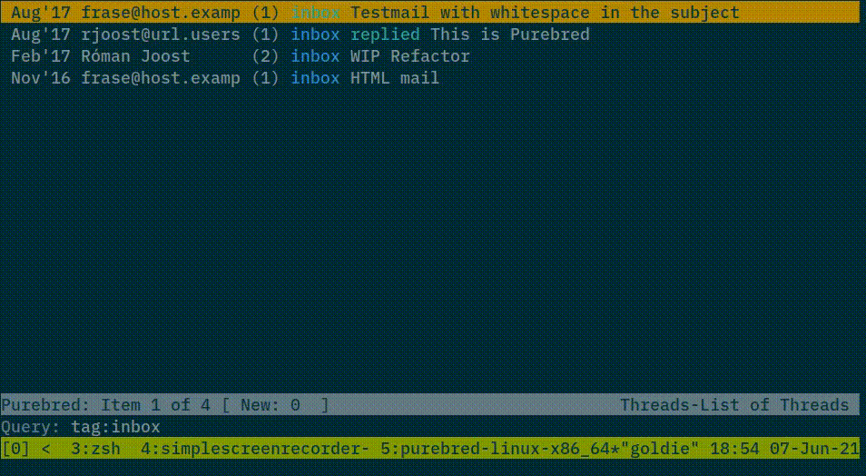

# purebred


An MUA built around [_notmuch_](https://notmuchmail.org/).

## Requirements

- GHC >= 9.6
- notmuch
- a local mailer (e.g. `sendmail`)

## Status

This project is immature, but please join us and help. We welcome
all kinds of contributions (bug reports, testing, documentation,
code). See [HACKING](HACKING) for more info. If you want to **jump
right in**, have a look at the [easy
fix](https://github.com/purebred-mua/purebred/issues?q=is%3Aopen+is%3Aissue+label%3Aeasyfix)
issues.



## Roadmap

In no particular order, planned features include:

- Plugin interface for processing mail before presentation.  This
  will enable encrypted mail (OpenPGP, S/MIME) plugins, among other
  things.

- Address book support.

- Improved mailcap support.

- Rendering and UI improvements.


## Try it

Try out purebred with the following choices. Note well: apart from
`cabal-install`, **none of the other options are tested by our CI**
and may be broken, or out of date.

### Fedora

We operate a
[Fedora Copr](https://copr.fedorainfracloud.org/coprs/romanofski/purebred/)
repository which provides easily installable RPM packages.

### Nix

If you're using the nix package manager - whether on NixOS or any other Linux
distribution - you can build purebred too. You can use try out purebred without
installing it:

```
$ nix build && result/bin/purebred
```

and `nix profile install` to install the application:

```
$ nix profile install .#purebred-with-packages
```

There is also a default.nix file to be used with legacy nix.

### Arch Linux

We officially don't support Arch Linux, but will support any packaging
efforts. Please see
[#352](https://github.com/purebred-mua/purebred/issues/352#issuecomment-567873060)
for links to help building Purebred.

### Cabal

Install development packages for system library dependencies
first. They are needed to compile the Haskell notmuch
bindings. Note that package names vary among distributions.

- libtalloc-devel
- notmuch-devel

Make sure you have one of our supported GHC versions and
`cabal-install >= 2.4` installed.  From a cloned checkout:

```
# Update the package list needed for cabal to download dependencies
$ cabal v2-update

# Builds all dependencies, the purebred library and executable and
# installs it to ~/.cabal/bin
$ cabal v2-build
Resolving dependencies...
Build profile: ...
In order, the following will be built (use -v for more details):
 - ...
 - ...
$ cabal v2-install exe:purebred

# start purebred
$ ~/.cabal/bin/purebred
```
