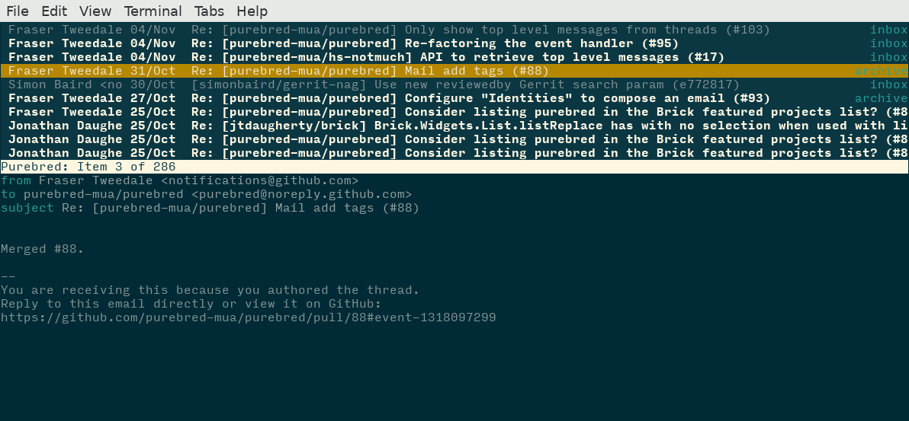

# purebred

An MUA built around [*notmuch*](https://notmuchmail.org/).

## requirements

- GHC >= 8.0
- notmuch
- a local mailer (e.g. ``sendmail``)

## Status

This project is in its infancy, but please join us and help.  All
kinds of contributions (bug reports, testing, documentation, code)
are welcome.  See [HACKING] for more info.

## Development packages
### Fedora

We operate a
[Fedora Copr](https://copr.fedorainfracloud.org/coprs/romanofski/purebred/)
repository which provides easily installable RPM packages.
