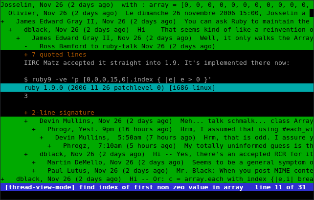
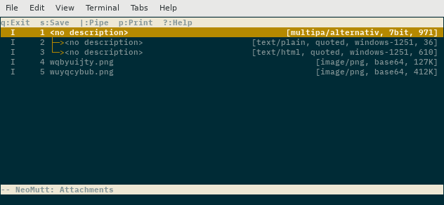

% Purebred
% Róman Joost
% 9th October 2018

# TOC

## Presentation

* Motivation
* Current Working State
* Lessons Learned

## About Me

* Started learning Haskell about 3 years ago, thanks to Fraser
* Implemented various side projects
  * gtfsschedule, consumes translink data and minimizes my waiting time for catching the bus/train
* worked at Red Hat as a software engineer/product manager writing mostly
  Python, Ruby, Perl, C, Bash etc

# Motivation

## Problem Statement

* Most mailers are file based with poor search performance
* Most TUI mailers are ancient and not maintained or carry lots of baggage
* notmuch provides fast global search and a tag based email system based on xapian
  * does not modify the mail directory

## Why building something new?

* use the benefits of Haskell
  * Use strong type system to enforce valid programs
* notmuch provides fast access to all mails and great search capabilities
* Leverage some of the UI knowledge build into existing TUI clients

## For me?

* purely educational

# What can we re-use?

## Existing mail libraries

* [state of e-mail parsing](https://gist.github.com/chrisdone/47a9e22672b54dedc87dec8b415e8127)
  * most of them not state of the art anymore
  * some don't parse correctly
  * some have performance problems
* used mime until we had purebred-email as a replacement

## What needs to be build?

* Everything!
* UI, notmuch binding, Parser - Generator

## 1.0 release

* minimally viable product for sending and reading mail
* Bare minimum on input validation
* no spiffy UI
* UI based loosely on mutt

## Goal

* UI as user friendly as sup
* reasonably fast
* Plugin-API for non-core functionality

## Sup



## Mutt



# Development Progress

## UI

* started last year in July with a text document listing our ideas
* use Brick
* config is Haskell code, following the XMonad approach
* heavy resemblance on mutt

## What is Brick?

* declarative terminal user interface library
* useful for building TUI's very quickly
* API in flux

## Notmuch

* existing binding written by Fraser
* needed performance improvements
  * e.g. hunting segfaults, pointer ownership
  * see [Fraser's YOW Lambda Jam 2018 talk](https://www.youtube.com/watch?v=9Dms5D-7zg0&index=28&list=PLIpl4GKFQR6fyK1MmpDVHqH7txoHfCk) for details


## Parser library

* started by Fraser
* uses lenses heavily
* great performance boost with Fraser's discovery to use Boyer-Moore string
  search algorithm to find boundary delimiters
  * caveat: uses attoparsec internals, but may generalise across other parsers
  * parsing a 25MB email now 0.01s from 4.37s
* growing unit test base
* finished round trip for 7bit mail, but API is still heavily in flux

# Snags we hit

## Code organisation

* modules and code currently disorganized
* backlog item to "clean" this up before 1.0 release

## Hardware/Linux Kernel related

* [Purebred hangs after about one minute #180 ]( https://github.com/purebred-mua/purebred/issues/180 )

# What has worked out?

## Configuration to build a valid program

* Keybindings use proxy types to prevent registering actions for non-sensicle UI parts
* DEMO

## Automated Acceptance Tests

* Simulating user input with tmux
* Using `testCaseSteps` from `Test.Tasty.HUnit`

## Example

```Haskell
testConfig :: Int -> TestTree
testConfig = withTmuxSession "test custom config" $
  \step -> do
    testdir <- view (envDir . ask)
    setEnvVarInSession "GHC" "stack"
    setEnvVarInSession "GHC_ARGS" "\"$STACK_ARGS ghc --\""
    setEnvVarInSession "PUREBRED_CONFIG_DIR" testdir

    startApplication

    liftIO $ step "archive thread"
    sendKeys "a" (Literal "archive")

    liftIO $ step "quit"
    sendKeys "q" (Literal "purebred")

    pure ()
```

## Takeaways from implementing Acceptances Tests

* Timing problems:
  * Not waiting for the terminal to be "re-painted" produces randomly failing tests
* ancient package version on travis:
  tmux >= 2.5 changed how it represented fg, bg color escape sequences
* high color vs low-color terminal sequences
* races with tmux-server between test tearDown and setUp

## Anecdotal: Discussions using Types

* Less ambiguous than in other languages
* Very useful when discussing implementation details before writing code

## Anecdotal: Refactoring tends to evolve the code

* Focusing on data instead of state allows to mend the code easier

::: notes

* Example: change in
```Haskell
messageToMailView :: AppState -> MIMEMessage -> Widget Name
```
:::

# What's next?

## Mail parser - Generating Mails

* 8bit mail and quoted printable is needed
* folding long lines to 78 characters
* edge cases like parameter value continuations (RFC2231)

```
# Folding of a field value
Subject: This
    is a test

# Parameter value continuation example
Content-Type: application/x-stuff
    title*0*=us-ascii'en'This%20is%20even%20more%20
    title*1*=%2A%2A%2Afun%2A%2A%2A%20
    title*2="isn't it!"
```

## UI

* Heaps of features missing to at least catch up with status quo
* 75% of items for 1.0 are done, yet the last quarter is usually the hardest

# How to help

## Pick items from the backlog

* Happy to mentor on features/bugfixes whoever wants to contribute
* Write documentation (e.g. man pages), test it, provide feedback
* purebred: [https://github.com/purebred-mua/purebred/issues](https://github.com/purebred-mua/purebred/issues?q=is%3Aopen+is%3Aissue+milestone%3A1.0)
* purebred-email: [https://github.com/purebred-mua/purebred-email/issues](https://github.com/purebred-mua/purebred-email/issues)

# ... the Rest

## Similar Projects

* [bower](https://github.com/wangp/bower) implemented in Mercury, a
  logic/functional programming language
* [alot](https://github.com/pazz/alot) implemented in Python
* there are more notmuch clients, including integration for Emacs and mutt

## References

* purebred project on github [https://github.com/purebred-mua](https://github.com/purebred-mua)
* [A Little Lens Starter Tutorial](https://www.schoolofhaskell.com/school/to-infinity-and-beyond/pick-of-the-week/a-little-lens-starter-tutorial#what-is-lens-)
